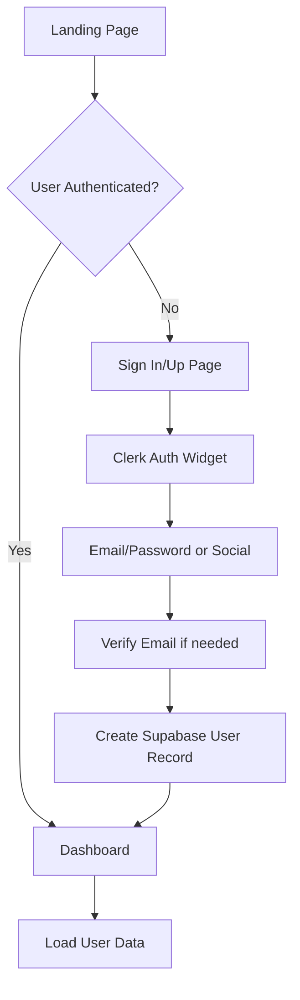
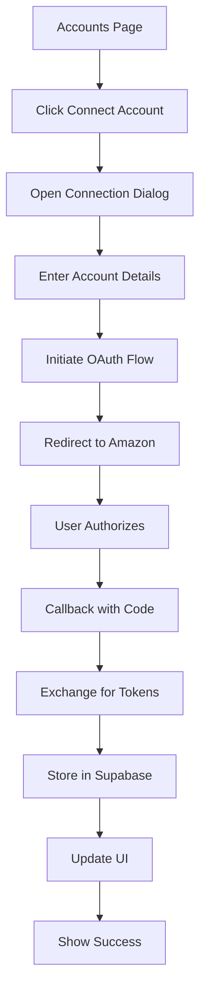

# Frontend Specification

> Spec: Clerk Authentication & Amazon Account Sync - Frontend Implementation
> Created: 2025-09-13

## Component Hierarchy & Structure

### Application Layout Structure

```
app/
├── (auth)/
│   ├── sign-in/
│   │   └── [[...sign-in]]/
│   │       └── page.tsx
│   ├── sign-up/
│   │   └── [[...sign-up]]/
│   │       └── page.tsx
│   └── layout.tsx
├── (dashboard)/
│   ├── dashboard/
│   │   └── page.tsx
│   ├── accounts/
│   │   └── page.tsx
│   ├── settings/
│   │   └── page.tsx
│   └── layout.tsx
├── api/
│   ├── auth/
│   │   └── sync/
│   │       └── route.ts
│   └── accounts/
│       └── [...routes].ts
├── layout.tsx
└── page.tsx
```

### Component Tree

```
<RootLayout>
  <ClerkProvider>
    <ThemeProvider>
      <QueryClientProvider>
        <AuthLayout | DashboardLayout>
          <Header>
            <Logo />
            <Navigation />
            <UserNav>
              <ProfileDropdown>
                <UserInfo />
                <MenuItems />
              </ProfileDropdown>
            </UserNav>
          </Header>
          <MainContent>
            <PageContent />
          </MainContent>
        </AuthLayout | DashboardLayout>
      </QueryClientProvider>
    </ThemeProvider>
  </ClerkProvider>
</RootLayout>
```

## UI Components (shadcn/ui)

### Core Components

#### 1. Authentication Components

```tsx
// components/auth/sign-in-form.tsx
- Card, CardContent, CardDescription, CardHeader, CardTitle
- Form, FormControl, FormField, FormItem, FormLabel, FormMessage
- Input
- Button
- Separator
- Alert, AlertDescription
```

#### 2. Header & Navigation

```tsx
// components/layout/header.tsx
- NavigationMenu, NavigationMenuContent, NavigationMenuItem
- NavigationMenuLink, NavigationMenuList, NavigationMenuTrigger

// components/layout/user-nav.tsx
- DropdownMenu, DropdownMenuContent, DropdownMenuItem
- DropdownMenuLabel, DropdownMenuSeparator, DropdownMenuTrigger
- Avatar, AvatarFallback, AvatarImage
- Badge
```

#### 3. Dashboard Components

```tsx
// components/dashboard/stats-cards.tsx
- Card, CardContent, CardDescription, CardHeader, CardTitle
- Skeleton (for loading states)
- Progress

// components/dashboard/account-switcher.tsx
- Select, SelectContent, SelectItem, SelectTrigger, SelectValue
- Command, CommandEmpty, CommandGroup, CommandInput, CommandItem
- Popover, PopoverContent, PopoverTrigger
```

#### 4. Account Management

```tsx
// components/accounts/account-list.tsx
- Table, TableBody, TableCell, TableHead, TableHeader, TableRow
- Badge (for status indicators)
- Button (for actions)
- DropdownMenu (for row actions)

// components/accounts/connect-account-dialog.tsx
- Dialog, DialogContent, DialogDescription, DialogFooter
- DialogHeader, DialogTitle, DialogTrigger
- Form components
- Alert (for connection status)
```

#### 5. Settings & Profile

```tsx
// components/settings/profile-form.tsx
- Form, FormControl, FormDescription, FormField, FormItem, FormLabel
- Input, Textarea
- Switch (for preferences)
- Button
- Tabs, TabsContent, TabsList, TabsTrigger
```

### Component Configuration

```tsx
// lib/components.ts
export const buttonVariants = {
  default: "bg-purple-600 hover:bg-purple-700",
  destructive: "bg-red-600 hover:bg-red-700",
  outline: "border-purple-200 hover:bg-purple-50",
  secondary: "bg-purple-100 hover:bg-purple-200",
  ghost: "hover:bg-purple-50",
  link: "text-purple-600 hover:text-purple-700"
}

export const cardVariants = {
  default: "border-purple-100",
  highlighted: "border-purple-300 bg-purple-50/50"
}
```

## State Management Approach

### 1. Global State (Zustand)

```typescript
// stores/useAuthStore.ts
interface AuthStore {
  user: User | null
  isLoading: boolean
  setUser: (user: User | null) => void
}

// stores/useAccountStore.ts
interface AccountStore {
  accounts: AmazonAccount[]
  activeAccount: AmazonAccount | null
  isConnecting: boolean
  setActiveAccount: (account: AmazonAccount) => void
  addAccount: (account: AmazonAccount) => void
  removeAccount: (accountId: string) => void
  updateAccountStatus: (accountId: string, status: AccountStatus) => void
}

// stores/useUIStore.ts
interface UIStore {
  sidebarOpen: boolean
  theme: 'light' | 'dark' | 'system'
  toggleSidebar: () => void
  setTheme: (theme: Theme) => void
}
```

### 2. Server State (TanStack Query)

```typescript
// hooks/useAccounts.ts
export const useAccounts = () => {
  return useQuery({
    queryKey: ['accounts'],
    queryFn: fetchAccounts,
    staleTime: 5 * 60 * 1000, // 5 minutes
  })
}

// hooks/useAccountSync.ts
export const useAccountSync = () => {
  return useMutation({
    mutationFn: syncAmazonAccount,
    onSuccess: () => {
      queryClient.invalidateQueries({ queryKey: ['accounts'] })
    }
  })
}

// hooks/useTokenRefresh.ts
export const useTokenRefresh = (accountId: string) => {
  return useMutation({
    mutationFn: () => refreshToken(accountId),
    onSuccess: (data) => {
      queryClient.setQueryData(['account', accountId], data)
    }
  })
}
```

### 3. Form State (React Hook Form + Zod)

```typescript
// schemas/account.schema.ts
export const connectAccountSchema = z.object({
  accountName: z.string().min(1, "Account name is required"),
  region: z.enum(['NA', 'EU', 'FE']),
  advertiserId: z.string().optional(),
})

// schemas/profile.schema.ts
export const profileSchema = z.object({
  displayName: z.string().min(2).max(50),
  email: z.string().email(),
  defaultAccount: z.string().optional(),
  notifications: z.object({
    tokenExpiry: z.boolean(),
    syncErrors: z.boolean(),
    weeklyReport: z.boolean(),
  })
})
```

## Routing Structure

### Route Configuration

```typescript
// app/middleware.ts
export const config = {
  matcher: [
    '/((?!api|_next/static|_next/image|favicon.ico).*)',
  ],
}

// Public routes (no auth required)
const publicRoutes = [
  '/',
  '/sign-in',
  '/sign-up',
  '/api/webhooks/clerk',
]

// Protected routes (auth required)
const protectedRoutes = [
  '/dashboard',
  '/accounts',
  '/settings',
  '/api/accounts',
  '/api/sync',
]
```

### Navigation Structure

```typescript
// config/navigation.ts
export const mainNavigation = [
  {
    title: 'Dashboard',
    href: '/dashboard',
    icon: 'LayoutDashboard',
    requiresAuth: true,
  },
  {
    title: 'Accounts',
    href: '/accounts',
    icon: 'Users',
    requiresAuth: true,
  },
  {
    title: 'Settings',
    href: '/settings',
    icon: 'Settings',
    requiresAuth: true,
  },
]

export const profileDropdownItems = [
  {
    label: 'Profile',
    href: '/settings/profile',
    icon: 'User',
  },
  {
    label: 'Accounts',
    href: '/accounts',
    icon: 'Building',
  },
  {
    label: 'Settings',
    href: '/settings',
    icon: 'Settings',
  },
  {
    type: 'separator',
  },
  {
    label: 'Sign out',
    action: 'signOut',
    icon: 'LogOut',
  },
]
```

## User Flows & Interactions

### 1. Authentication Flow



#### Implementation Details

```tsx
// app/(auth)/sign-in/[[...sign-in]]/page.tsx
import { SignIn } from "@clerk/nextjs"

export default function SignInPage() {
  return (
    <div className="flex min-h-screen items-center justify-center">
      <SignIn
        appearance={{
          elements: {
            formButtonPrimary: 'bg-purple-600 hover:bg-purple-700',
            card: 'shadow-lg',
          },
        }}
        redirectUrl="/dashboard"
        afterSignInUrl="/dashboard"
      />
    </div>
  )
}
```

### 2. Dashboard with Profile Dropdown

```tsx
// components/layout/user-nav.tsx
export function UserNav() {
  const { user } = useUser()
  const router = useRouter()
  const { signOut } = useClerk()

  return (
    <DropdownMenu>
      <DropdownMenuTrigger asChild>
        <Button variant="ghost" className="relative h-8 w-8 rounded-full">
          <Avatar className="h-8 w-8">
            <AvatarImage src={user?.imageUrl} alt={user?.fullName} />
            <AvatarFallback>{user?.firstName?.[0]}</AvatarFallback>
          </Avatar>
        </Button>
      </DropdownMenuTrigger>
      <DropdownMenuContent className="w-56" align="end" forceMount>
        <DropdownMenuLabel className="font-normal">
          <div className="flex flex-col space-y-1">
            <p className="text-sm font-medium">{user?.fullName}</p>
            <p className="text-xs text-muted-foreground">{user?.emailAddresses[0]?.emailAddress}</p>
          </div>
        </DropdownMenuLabel>
        <DropdownMenuSeparator />
        <DropdownMenuItem onClick={() => router.push('/accounts')}>
          <Building className="mr-2 h-4 w-4" />
          <span>Accounts</span>
        </DropdownMenuItem>
        <DropdownMenuItem onClick={() => router.push('/settings')}>
          <Settings className="mr-2 h-4 w-4" />
          <span>Settings</span>
        </DropdownMenuItem>
        <DropdownMenuSeparator />
        <DropdownMenuItem onClick={() => signOut()}>
          <LogOut className="mr-2 h-4 w-4" />
          <span>Log out</span>
        </DropdownMenuItem>
      </DropdownMenuContent>
    </DropdownMenu>
  )
}
```

### 3. Account Management Page

```tsx
// app/(dashboard)/accounts/page.tsx
export default function AccountsPage() {
  const { accounts, isLoading } = useAccounts()
  const [isConnectDialogOpen, setIsConnectDialogOpen] = useState(false)

  return (
    <div className="space-y-6">
      <div className="flex items-center justify-between">
        <h1 className="text-3xl font-bold">Amazon Accounts</h1>
        <Button onClick={() => setIsConnectDialogOpen(true)}>
          <Plus className="mr-2 h-4 w-4" />
          Connect Account
        </Button>
      </div>

      <Card>
        <CardHeader>
          <CardTitle>Connected Accounts</CardTitle>
          <CardDescription>
            Manage your Amazon Advertising API connections
          </CardDescription>
        </CardHeader>
        <CardContent>
          <AccountList accounts={accounts} />
        </CardContent>
      </Card>

      <ConnectAccountDialog
        open={isConnectDialogOpen}
        onOpenChange={setIsConnectDialogOpen}
      />
    </div>
  )
}
```

### 4. Amazon Account Connection Flow



#### Connection Dialog Implementation

```tsx
// components/accounts/connect-account-dialog.tsx
export function ConnectAccountDialog({ open, onOpenChange }) {
  const [step, setStep] = useState<'details' | 'connecting' | 'success'>('details')
  const { mutate: connectAccount } = useAccountSync()

  const form = useForm({
    resolver: zodResolver(connectAccountSchema),
    defaultValues: {
      accountName: '',
      region: 'NA',
    },
  })

  const onSubmit = async (data: ConnectAccountData) => {
    setStep('connecting')
    
    // Initiate OAuth flow
    const authUrl = buildAmazonAuthUrl({
      clientId: process.env.NEXT_PUBLIC_AMAZON_CLIENT_ID,
      redirectUri: `${window.location.origin}/api/auth/callback`,
      state: generateState(data),
    })
    
    // Open in popup or redirect
    const authWindow = window.open(authUrl, 'amazon-auth', 'width=500,height=600')
    
    // Listen for callback
    window.addEventListener('message', handleAuthCallback)
  }

  return (
    <Dialog open={open} onOpenChange={onOpenChange}>
      <DialogContent className="sm:max-w-[425px]">
        <DialogHeader>
          <DialogTitle>Connect Amazon Account</DialogTitle>
          <DialogDescription>
            Connect your Amazon Advertising account to sync data
          </DialogDescription>
        </DialogHeader>
        
        {step === 'details' && (
          <Form {...form}>
            <form onSubmit={form.handleSubmit(onSubmit)} className="space-y-4">
              <FormField
                control={form.control}
                name="accountName"
                render={({ field }) => (
                  <FormItem>
                    <FormLabel>Account Name</FormLabel>
                    <FormControl>
                      <Input placeholder="My Amazon Account" {...field} />
                    </FormControl>
                    <FormMessage />
                  </FormItem>
                )}
              />
              
              <FormField
                control={form.control}
                name="region"
                render={({ field }) => (
                  <FormItem>
                    <FormLabel>Region</FormLabel>
                    <Select onValueChange={field.onChange} defaultValue={field.value}>
                      <FormControl>
                        <SelectTrigger>
                          <SelectValue placeholder="Select a region" />
                        </SelectTrigger>
                      </FormControl>
                      <SelectContent>
                        <SelectItem value="NA">North America</SelectItem>
                        <SelectItem value="EU">Europe</SelectItem>
                        <SelectItem value="FE">Far East</SelectItem>
                      </SelectContent>
                    </Select>
                    <FormMessage />
                  </FormItem>
                )}
              />
              
              <DialogFooter>
                <Button type="submit">Connect Account</Button>
              </DialogFooter>
            </form>
          </Form>
        )}
        
        {step === 'connecting' && (
          <div className="flex flex-col items-center space-y-4 py-6">
            <Loader2 className="h-8 w-8 animate-spin text-purple-600" />
            <p className="text-sm text-muted-foreground">
              Connecting to Amazon...
            </p>
          </div>
        )}
        
        {step === 'success' && (
          <div className="flex flex-col items-center space-y-4 py-6">
            <CheckCircle className="h-8 w-8 text-green-600" />
            <p className="text-sm font-medium">Account connected successfully!</p>
            <Button onClick={() => onOpenChange(false)}>Done</Button>
          </div>
        )}
      </DialogContent>
    </Dialog>
  )
}
```

### 5. Multi-Account Switching UI

```tsx
// components/dashboard/account-switcher.tsx
export function AccountSwitcher() {
  const { accounts, activeAccount, setActiveAccount } = useAccountStore()
  const [open, setOpen] = useState(false)

  return (
    <Popover open={open} onOpenChange={setOpen}>
      <PopoverTrigger asChild>
        <Button
          variant="outline"
          role="combobox"
          aria-expanded={open}
          className="w-[200px] justify-between"
        >
          {activeAccount ? (
            <>
              <Building className="mr-2 h-4 w-4" />
              {activeAccount.name}
            </>
          ) : (
            "Select account..."
          )}
          <ChevronsUpDown className="ml-2 h-4 w-4 shrink-0 opacity-50" />
        </Button>
      </PopoverTrigger>
      <PopoverContent className="w-[200px] p-0">
        <Command>
          <CommandInput placeholder="Search account..." />
          <CommandEmpty>No account found.</CommandEmpty>
          <CommandGroup>
            {accounts.map((account) => (
              <CommandItem
                key={account.id}
                onSelect={() => {
                  setActiveAccount(account)
                  setOpen(false)
                }}
              >
                <Check
                  className={cn(
                    "mr-2 h-4 w-4",
                    activeAccount?.id === account.id ? "opacity-100" : "opacity-0"
                  )}
                />
                <div className="flex flex-col">
                  <span>{account.name}</span>
                  <span className="text-xs text-muted-foreground">
                    {account.region} - {account.advertiserId}
                  </span>
                </div>
              </CommandItem>
            ))}
          </CommandGroup>
        </Command>
      </PopoverContent>
    </Popover>
  )
}
```

## Loading States & Error Handling

### Loading States

```tsx
// components/ui/loading-skeleton.tsx
export function AccountsLoadingSkeleton() {
  return (
    <div className="space-y-4">
      {[...Array(3)].map((_, i) => (
        <div key={i} className="flex items-center space-x-4">
          <Skeleton className="h-12 w-12 rounded-full" />
          <div className="space-y-2">
            <Skeleton className="h-4 w-[250px]" />
            <Skeleton className="h-4 w-[200px]" />
          </div>
        </div>
      ))}
    </div>
  )
}
```

### Error Boundaries

```tsx
// components/error-boundary.tsx
export function AccountErrorBoundary({ children }) {
  return (
    <ErrorBoundary
      fallback={
        <Alert variant="destructive">
          <AlertCircle className="h-4 w-4" />
          <AlertTitle>Error</AlertTitle>
          <AlertDescription>
            Failed to load account information. Please try refreshing the page.
          </AlertDescription>
        </Alert>
      }
    >
      {children}
    </ErrorBoundary>
  )
}
```

## Accessibility Considerations

1. **Keyboard Navigation**: All interactive elements are keyboard accessible
2. **ARIA Labels**: Proper ARIA labels for screen readers
3. **Focus Management**: Proper focus trap in modals and dropdowns
4. **Color Contrast**: WCAG AA compliant color combinations
5. **Loading Announcements**: Screen reader announcements for async operations

## Performance Optimizations

1. **Code Splitting**: Dynamic imports for heavy components
2. **Image Optimization**: Next.js Image component for avatars
3. **Suspense Boundaries**: React Suspense for data fetching
4. **Memoization**: React.memo for expensive components
5. **Virtual Scrolling**: For large account lists
6. **Optimistic Updates**: Immediate UI feedback for user actions

## Theme Configuration

```typescript
// app/globals.css
@layer base {
  :root {
    --background: 0 0% 100%;
    --foreground: 240 10% 3.9%;
    --card: 0 0% 100%;
    --card-foreground: 240 10% 3.9%;
    --popover: 0 0% 100%;
    --popover-foreground: 240 10% 3.9%;
    --primary: 271 91% 65%; /* Purple-600 */
    --primary-foreground: 0 0% 98%;
    --secondary: 271 91% 95%; /* Purple-100 */
    --secondary-foreground: 271 91% 25%;
    --muted: 240 4.8% 95.9%;
    --muted-foreground: 240 3.8% 46.1%;
    --accent: 271 91% 95%;
    --accent-foreground: 271 91% 25%;
    --destructive: 0 84.2% 60.2%;
    --destructive-foreground: 0 0% 98%;
    --border: 271 30% 90%;
    --input: 271 30% 90%;
    --ring: 271 91% 65%;
    --radius: 0.5rem;
  }
}
```

## Testing Strategy

### Unit Tests

```typescript
// __tests__/components/user-nav.test.tsx
describe('UserNav', () => {
  it('displays user information correctly', () => {
    // Test implementation
  })
  
  it('opens dropdown on click', () => {
    // Test implementation
  })
  
  it('navigates to correct routes', () => {
    // Test implementation
  })
})
```

### Integration Tests

```typescript
// __tests__/flows/account-connection.test.tsx
describe('Account Connection Flow', () => {
  it('completes OAuth flow successfully', async () => {
    // Test implementation
  })
  
  it('handles connection errors gracefully', async () => {
    // Test implementation
  })
})
```

### E2E Tests

```typescript
// e2e/auth-flow.spec.ts
test('complete authentication and account setup', async ({ page }) => {
  // Navigate to sign-in
  // Complete authentication
  // Verify dashboard access
  // Connect Amazon account
  // Verify account in list
})
```

## Mobile Responsiveness

All components are designed with mobile-first approach:

1. **Responsive Navigation**: Hamburger menu on mobile
2. **Touch-Friendly**: Minimum 44px touch targets
3. **Adaptive Layouts**: Stack on mobile, side-by-side on desktop
4. **Gesture Support**: Swipe to dismiss, pull to refresh
5. **Progressive Disclosure**: Show essential info first

## Security Considerations

1. **CSRF Protection**: Tokens for state-changing operations
2. **XSS Prevention**: Proper input sanitization
3. **Secure Storage**: No sensitive data in localStorage
4. **Content Security Policy**: Strict CSP headers
5. **Rate Limiting**: API call throttling on frontend